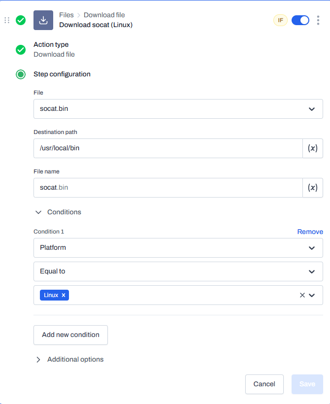
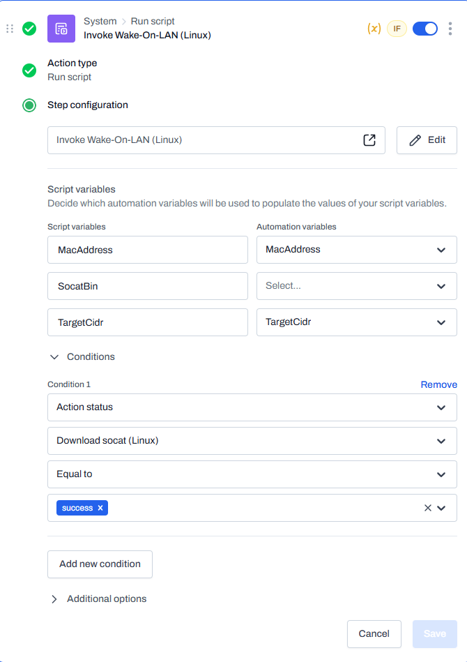
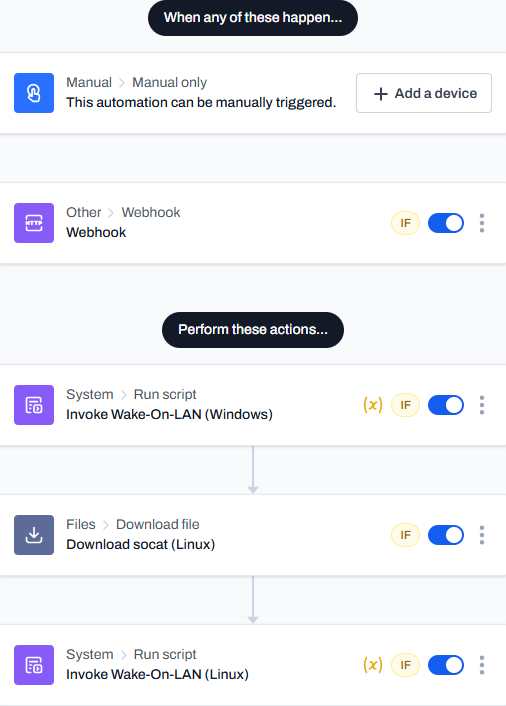

## Introduction
Hi Level community! I want to share a Wake-On-LAN solution that I've cooked up. The Level devs have this feature on their radar, but it's currently in the backlog, which is understandable as there are a ton of higher-priority (in my opinion) features that they are currently working on.

> [!NOTE]
> UPDATED July 8, 2025: [Linux support added](LINUX.md)

### Notes and Disclaimer
- I am not an expert. I'm sure the scripts below reflect that. Let me know if I've done something dumb so I can learn to be better.
- The PowerShell script targets Windows 10/11 and PowerShell 5.1. You'll probably run into issues on other versions of Windows or PowerShell.
- The Bash script should work on most modern Linux distributions, but I'm sure there are exceptions.
- This is largely untested. It's worked in my environment, but review my scripts and make your own judgement if they are safe or not.
- I take no responsibility if your production environment is set ablaze due to using these scripts.
### Background Information
For a Wake-On-LAN solution, the ideal user experience should operate something like this: Locate the offline device in Level's device list, and run an automation on that device. Everything else should happen automagically. Until recently, this didn't seem like a possibility. If you run an automation on an offline device, how is it supposed to trigger another automation to run on another device in order to wake it?

With the May 8, 2025 release, we got a couple of very welcome features like the Run Automation action. In its current state, it doesn't allow you to run an automation on *another* device which would be helpful here. However, we did receive another feature, the HTTP Request action. Considering that we can leverage the Level API to trigger an automation to run on a device of our choosing, a possible solution might look like this:
- Manually trigger a "Send Wake-On-LAN" automation on the offline device.
- An HTTP request action triggers a second automation on another device via webhook trigger.
- A PowerShell script runs on that second device which generates the Wake-On-LAN packet.
- ???
- Profit.
## Prerequisites
A few prerequisites need to be defined:
1. A target subnet.
2. The MAC address of each target device.
3. A sending device which will broadcast the WOL magic packet.
### 1. The Target Subnet
Wake-On-LAN works by broadcasting a specially-crafted packet to the network, and as such, it can generally only be used within a given subnet.

Create a custom field named `Wake-On-LAN Subnet` and populate it with the target subnet in CIDR notation.

> [!NOTE]
> This custom field can be scoped at a group level so that each environment has its own target subnet.

### 2. The MAC Address
The WOL magic packet needs to contain the MAC address of the device that we wish to wake. Level does not currently expose devices' MAC addresses via [System Variables](https://docs.level.io/en/articles/11321970-system-variables), so we'll need to define each device's MAC address within a custom field.
#### 2a. Get MAC Address Script
This could be done manually, but I wrote an osquery statement/script to automate the process. This script seems to work on my Windows and Linux endpoints; macOS likely needs some changes. First, create a global custom field named `MAC Address`, then import the [get-mac-address.sql](src/get-mac-address.sql) script into Level with the following properties.

**Script Name:** Get MAC Address  
**Language:** osquery  
**Timeout (in seconds):** 100  
**Run as:** Local system  

#### 2b. Get MAC Address Automation
Create an automation to run the script and set the device custom field as described below:

**Automation name:** Get MAC Address  
**Trigger:** Manual  
**Variables:**  

| Name       | Default value |
| ---------- | ------------- |
| MacAddress | *(none)*      |

**Action 1**  
**Type:** Run script  
**Script:** Get MAC Address  
**Condition 1:** Platform **equal to** Windows, Linux  
**Assign action output to variable:** MacAddress  


**Action 2**  
**Type:** Set custom field  
**Custom field:** MAC Address  
**Variable:** MacAddress  
**Condition 1:** Action status "Get MAC Address" **equal to** success  
**Condition 2:** Variable "MacAddress" **not equal to** no results  


Run the automation on a test machine and verify that the device's MAC Address custom field was populated with the correct value. This automation could potentially be incorporated into an onboarding automation to ensure all new devices have the custom field defined.
### 3. The Sending Device
When choosing a device that will broadcast the WOL magic packet to the target subnet, we prefer a device that will always be online. A server might be a suitable choice (but don't blame me if my script breaks your production server). We will need the Level Device ID which can be obtained from the device URL (see the screenshot below) or from the [Level API](https://levelapi.readme.io/reference/listdevices).


Create a custom field named `Wake-On-LAN Device` containing the Device ID to be used.

> [!NOTE]
> This custom field can be scoped at a group level so that each environment has its own dedicated sending device.


## The Wake-On-LAN Implementation
With the prerequisites out of the way, we'll implement the Wake-On-LAN solution which consists of two scripts and two automations.
### 1. Wake-On-LAN Scripts
The Wake-On-LAN scripts are responsible for crafting and sending the magic packet.
#### 1a. PowerShell (Windows)
This script requires PowerShell 5.1 is designed to work with Windows 10/11. There are no external dependencies beyond .NET 4.0+. It has not been extensively tested, and I suspect there are some compatibility issues with PowerShell 7+.

Import the [Invoke-WakeOnLan.ps1](src/Invoke-WakeOnLan.ps1) script into Level with the following properties.

**Script name:** Invoke Wake-On-LAN (Windows)  
**Language:** PowerShell  
**Timeout (in seconds):** 100  
**Run as:** Local system  
**Variables:**  

| Name       | Default value |
| ---------- | ------------- |
| MacAddress | *(none)*      |
| TargetCidr | *(none)*      |
#### 1b. Bash (Linux)
This script requires Bash 4.0+ and should run on a variety of distributions, but does depend on a `socat` binary. You could use your distribution's package manager to install `socat`, however I opted to build a statically-linked binary. Adjust or omit the `SocatBin` variable default value accordingly.

Import the [send-wol-packet.sh](src/send-wol-packet.sh) script into Level with the following properties.

**Script name:** Invoke Wake-On-LAN (Linux)  
**Language:** Bash  
**Timeout (in seconds):** 100  
**Run as:** Local system  
**Variables:**  

| Name       | Default value            |
| ---------- | -------------------------|
| MacAddress | *(none)*                 |
| SocatBin   | /usr/local/bin/socat.bin |
| TargetCidr | *(none)*                 |
### 2. Webhook Trigger
The webhook trigger will allow the automation to be called via the Level API. Create an automation as described below.

**Automation name:** Wake-On-LAN Webhook Trigger  
**Variables:**  

| Name       | Default value |
| ---------- | ------------- |
| MacAddress | *(none)*      |
| TargetCidr | *(none)*      |

**Trigger: Webhook**  
**Require an authorization header:** True  
**Parameter mapping:**  

| Parameter key | Automation variables |
| ------------- | -------------------- |
| MacAddress    | MacAddress           |
| TargetCidr    | TargetCidr           |

**Condition 1:** Platform **equal to** Windows, Linux  

> [!NOTE]
> IMPORTANT: Make note of the webhook trigger URL and authorization token (see the screenshot below), as we'll need those for the next step.


**Action 1**  
**Type:** Run script  
**Script:** Invoke Wake-On-LAN (Windows)  
**Script variables:**  

| Script variable | Automation variable |
| --------------- | ------------------- |
| MacAddress      | MacAddress          |
| TargetCidr      | TargetCidr          |

**Condition 1:** Platform **equal to** Windows  


**Action 2**  
**Type:** Download file  
**File:** socat.bin  
**Destination path:** /usr/local/bin  
**File name:** socat.bin  
**Condition 1:** Platform **equal to** Linux  
**Action name:** Download socat (Linux)  
> [!NOTE]
> Omit this action if you are using your package manager to install `socat`.



**Action 3**  
**Type:** Run script  
**Script:** Invoke Wake-On-LAN (Linux)  
**Script variables:**  

| Script variable | Automation variable |
| --------------- | ------------------- |
| MacAddress      | MacAddress          |
| SocatBin        | *(none)*            |
| TargetCidr      | TargetCidr          |

**Condition 1:** Action status "Download socat (Linux)" **equal to** success  





### 3. Send Wake-On-LAN Manual Trigger
Finally, we'll create the automation will be manually triggered on devices which you want to wake. Create an automation as described below.

**Automation name:** Send Wake-On-LAN  
**Trigger:** Manual only  

**Action 1**  
**Type:** HTTP request  
**URL:** *(paste the webhook trigger URL here)*  
**Method:** POST  
**Content type:** application/json  
**Content:**  *(paste the contents of [http-request.json](src/http-request.json) here)*  
**Headers:**  

| Header        | Value                                  |
| ------------- | -------------------------------------- |
| Authorization | *(paste the authorization token here)* |

**Action name:** Trigger Wake-On-LAN Webhook  


## Usage
With all the components now in place, the solution is ready to use. All the complex setup is done, and triggering a Wake-On-LAN request is simple.
- Navigate to the device you wish to wake in your Level device list.
- Under the kebab menu, select `Run Automation`.
- Select the `Send Wake-On-LAN` automation from the list and run it.

That's it! Behind the scenes, this action triggers the HTTP request to your webhook. The webhook automation then runs on your designated "sending" device, which crafts and broadcasts the magic packet to wake the target machine.

I hope this solution proves useful for managing your devices. If you run into any issues or have suggestions for improvement, please feel free to open an issue on this repository.

### Troubleshooting
If the target device isn't waking up, you can verify that the magic packet is actually being sent on the network. On a machine within the target subnet, you can use Wireshark to capture network traffic. After starting a capture, apply the following display filter:
```
(eth.dst == ff:ff:ff:ff:ff:ff) && (udp.dstport == 9)
```
This filter will only display UDP packets being sent to the broadcast MAC address on port 9. If you see packets appearing here after triggering the automation, you've confirmed the sending part of the solution is working correctly. If you do not see any packets, check the script output in Level.

If Wireshark confirms the packet is on the network but the target device remains offline, the issue is likely with the target device's configuration. Here are the most common things to check:
- **BIOS/UEFI Settings:** Reboot the target machine and enter its BIOS/UEFI setup. Ensure that Wake-on-LAN (often listed as "WoL", "Power On by LAN", or "Power On by PCI/PCIe Device") is enabled.
- **Network Adapter Power Settings (Windows):** In Device Manager, find your network adapter's properties and go to the "Power Management" tab. Ensure "Allow this device to wake the computer" is enabled.
- **Disable Fast Startup/Hibernation (Windows):** Hibernation can prevent WoL from working correctly. I recommend disabling fast startup, which also disables hibernation.
- **Physical Connection:** Confirm the device is connected via an Ethernet cable. WoL over Wi-Fi is generally not supported or reliable.