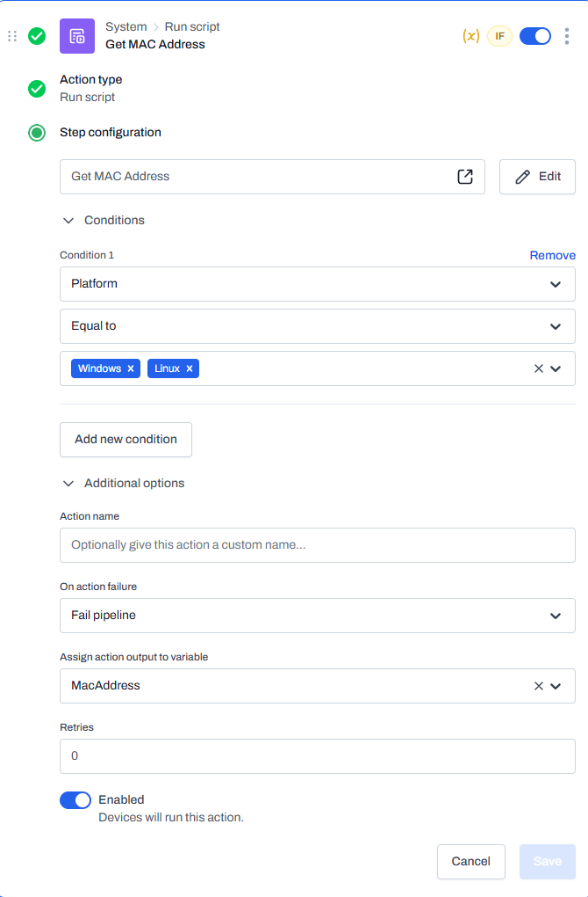
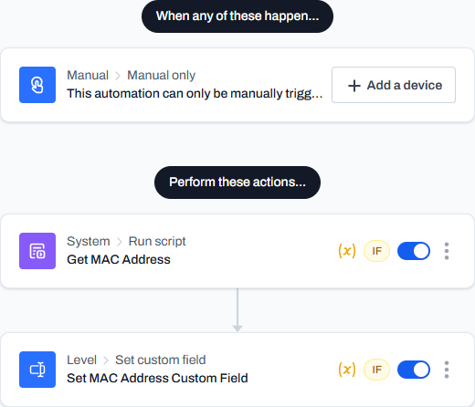
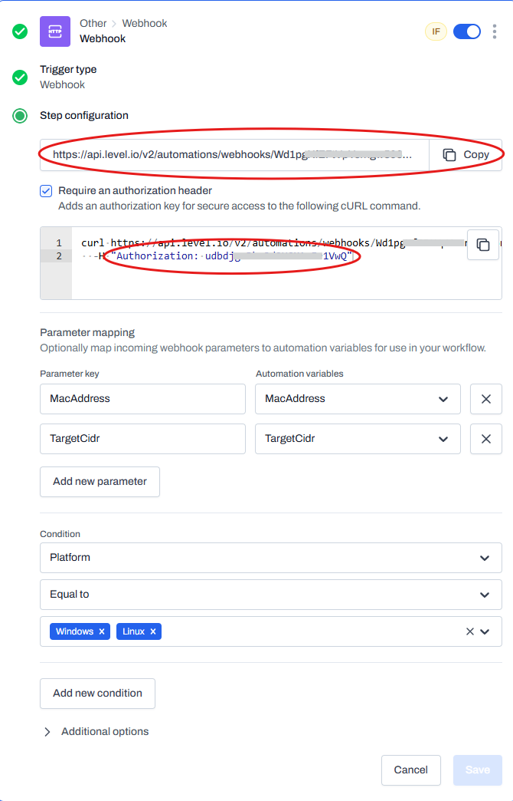

## Introduction
Hi Level community! I want to share a Wake-On-LAN solution that I've cooked up. The Level devs have this feature on their radar, but it's currently in the backlog, which is understandable as there are a ton of higher-priority (in my opinion) features that they are currently working on.
### Notes and Disclaimer
- I am not a PowerShell expert. I'm sure the scripts below reflect that. Let me know if I've done something dumb so I can learn to be better.
- My scripts target Windows 10/11 and PowerShell 5.1. I haven't tested this on any other platforms or versions. You'll probably run into issues if you try.
- This is largely untested. It's worked in my environment, but review my scripts and make your own judgement if they are safe or not.
- I take no responsibility if your production environment is set ablaze due to using these scripts.
### Background Information
For a Wake-On-LAN solution, the ideal user experience should operate something like this: Locate the offline device in Level's device list, and run an automation on that device. Everything else should happen automagically. Until recently, this didn't seem like a possibility. If you run an automation on an offline device, how is it supposed to trigger another automation to run on another device in order to wake it?

With the May 8, 2025 release, we got a couple of very welcome features like the Run Automation action. In its current state, it doesn't allow you to run an automation on *another* device which would be helpful here. However, we did receive another feature, the HTTP Request action. Considering that we can leverage the Level API to trigger an automation to run on a device of our choosing, a possible solution might look like this:
- Manually trigger a "Send Wake-On-LAN" automation on the offline device.
- An HTTP request action triggers a second automation on another device via webhook trigger.
- A PowerShell script runs on that second device which generates the Wake-On-LAN packet.
- ???
- Profit.
## Prerequisites
A few prerequisites need to be defined:
1. A target subnet.
2. The MAC address of each target device.
3. A sending device which will broadcast the WOL magic packet.
### 1. The Target Subnet
Wake-On-LAN works by broadcasting a specially-crafted packet to the network, and as such, it can generally only be used within a given subnet.

Create a custom field named `Wake-On-LAN Subnet` and populate it with the target subnet in CIDR notation.

> [!NOTE]
> This custom field can be scoped at a group level so that each environment has its own target subnet.

### 2. The MAC Address
The WOL magic packet needs to contain the MAC address of the device that we wish to wake. Level does not currently expose devices' MAC addresses via [System Variables](https://docs.level.io/en/articles/11321970-system-variables), so we'll need to define each device's MAC address within a custom field.
#### 2a. Get MAC Address Script
This could be done manually, but I wrote a script to automate the process. First, create a global custom field named `MAC Address`, then import the [Get-MacAddress.ps1](src/Get-MacAddress.ps1) script into Level with the following properties.

**Script Name:** Get MAC Address  
**Language:** PowerShell  
**Timeout (in seconds):** 100  
**Run as:** Local system  
**Variables:**  

| Name       | Default value |
| ---------- | ------------- |
| MacAddress | (none)        |
| TargetCidr | (none)        |
#### 2b. Get MAC Address Automation
Create an automation to run the script and set the device custom field as described below:

**Automation name:** Get MAC Address  
**Trigger:** Manual  
**Variables:**  

| Name       | Default value |
| ---------- | ------------- |
| MacAddress | (none)        |
| TargetCidr | (none)        |

**Action 1**  
**Type:** Shell  
**Language:** PowerShell  
**Timeout (in seconds):** 100  
**Run as:** Local system  
**Script:**  
```PowerShell
$TargetCidr="{{cf_wake-on-lan_subnet}}"
if (($TargetCidr -like "{{*}}") -or 
    [string]::IsNullOrWhiteSpace($TargetCidr)) {
    Write-Error "Wake-On-LAN Subnet custom field is undefined."
    exit 1
} else {
    {{TargetCidr=$TargetCidr}}
}
```
**Condition 1:** Platform **equal to** Windows  
**Condition 2:** Type **equal to** Workstation  
**Action name:** Get Target Subnet  


**Action 2**  
**Type:** Run script  
**Script:** Get MAC Address  
**Script variables:**  

| Script variable | Automation variable |
| --------------- | ------------------- |
| MacAddress      | MacAddress          |
| TargetCidr      | TargetCidr          |

**Condition 1:** Action status "Get Target Subnet" **equal to** success



**Action 3**  
**Type:** Set custom field  
**Custom field:** MAC Address  
**Variable:** MacAddress  
**Condition 1:** Action status "Get MAC Address" **equal to** success  




Run the automation on a test machine and verify that the device's MAC Address custom field was populated with the correct value. This automation could potentially be incorporated into an onboarding automation to ensure all new devices have the custom field defined.
### 3. The Sending Device
When choosing a device that will broadcast the WOL magic packet to the target subnet, we prefer a device that will always be online. A server might be a suitable choice (but don't blame me if my script breaks your production server). We will need the Level Device ID which can be obtained from the device URL (see the screenshot below) or from the [Level API](https://levelapi.readme.io/reference/listdevices).


Create a custom field named `Wake-On-LAN Device` containing the Device ID to be used.

> [!NOTE]
> This custom field can be scoped at a group level so that each environment has its own dedicated sending device.


## The Wake-On-LAN Implementation
With the prerequisites out of the way, we'll implement the Wake-On-LAN solution which consists of a PowerShell script and two automations.
### 1. PowerShell Script
Import the [Invoke-WakeOnLan.ps1](src/Invoke-WakeOnLan.ps1) script into Level with the following properties.

**Script name:** Invoke Wake-On-LAN  
**Language:** PowerShell  
**Timeout (in seconds):** 100  
**Run as:** Local system  
**Variables:**  

| Name       | Default value |
| ---------- | ------------- |
| MacAddress | (none)        |
| TargetCidr | (none)        |
### 2. Webhook Trigger
The webhook trigger will allow the automation to be called via the Level API. Create an automation as described below.

**Automation name:** Wake-On-LAN Webhook Trigger  
**Trigger: Webhook**  
Require an authorization header: True  
Parameter mappings:  

| Parameter key | Automation variables |
| ------------- | -------------------- |
| MacAddress    | MacAddress           |
| TargetCidr    | TargetCidr           |

**Condition 1:** Platform **equal to** Windows  
**Variables:**  

| Name       | Default value |
| ---------- | ------------- |
| MacAddress | (none)        |
| TargetCidr | (none)        |

> [!NOTE]
> IMPORTANT: Make note of the webhook trigger URL and authorization token, as we'll need those for the next step.



**Action 1**  
**Type:** Shell  
**Language:** PowerShell  
**Timeout (in seconds):** 100  
**Run as:** Local system  
**Script:**  
```PowerShell
$TargetCidr="{{cf_wake-on-lan_subnet}}"
if (($TargetCidr -like "{{*}}") -or 
    [string]::IsNullOrWhiteSpace($TargetCidr)) {
    Write-Error "Wake-On-LAN Subnet custom field is undefined."
    exit 1
} else {
    {{TargetCidr=$TargetCidr}}
}
```
**Condition 1:** Platform **equal to** Windows  
**Action name:** Get Target Subnet  


**Action 2**  
**Type:** Run script  
**Script:** Invoke Wake-On-LAN  
**Script variables:**  

| Script variable | Automation variable |
| --------------- | ------------------- |
| MacAddress      | MacAddress          |
| TargetCidr      | TargetCidr          |

**Condition 1:** Action status "Get Target Subnet" **equal to** success  


### 3. Send Wake-On-LAN Manual Trigger
Finally, we'll create the automation will be manually triggered on devices which you want to wake. Create an automation as described below.

**Automation name:** Send Wake-On-LAN  
**Trigger:** Manual only  

**Action 1**  
**Type:** HTTP request  
**URL:** (paste the webhook trigger URL here)  
**Method:** POST  
**Content type:** application/json  
**Content:**  
```json
{
  "device_ids": [
    "{{cf_wake-on-lan_device}}"
  ],
  "MacAddress": "{{cf_mac_address}}",
  "TargetCidr": "{{cf_wake-on-lan_subnet}}"
}
```
**Headers:**  

| Header        | Value                                |
| ------------- | ------------------------------------ |
| Authorization | (paste the authorization token here) |

**Action name:** Wake-On-LAN Webhook Trigger  


